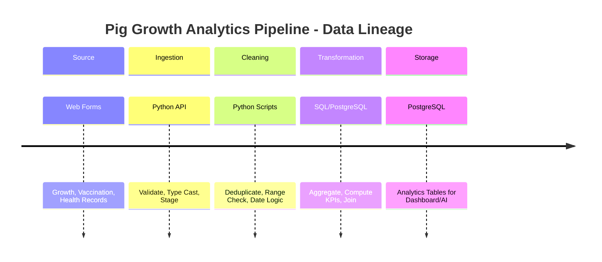

# PrepAPig: AI-Powered Pig Growth Tracker with Vaccination Scheduling and Feed Consumption System #

## Team Members 
| Name     | Role               |
| -------- | ------------------ |
| Patal, Mark Angelo G. | Backend Developer |
| Isabella Grace M. Elola | Frontend Developer  |
| Maris N. De Lunas | Frontend Developer |

## Overview 

PrepAPig is a web-based livestock management system designed to assist pig farmers and caretakers in monitoring pig growth, tracking feed consumption, and managing vaccination schedules. The system utilizes Artificial Intelligence (AI) to analyze growth trends and provide predictive insights that support decision-making in pig farming operations.

The project aims to improve farm productivity by digitizing traditional record-keeping processes, reducing manual errors, and providing real-time access to important livestock information.

## Features 

Pig profile management
Growth tracking and monitoring
Feed consumption recording
Vaccination scheduling and reminders
AI-powered growth prediction
Analytics and reporting dashboard
User authentication and role-based access control
Historical record management

## Project Motivation 

Traditional pig farming often relies on manual record-keeping methods that can be time-consuming, prone to errors, and difficult to manage. PrepAPig was developed to provide an efficient digital solution that centralizes livestock records, automates monitoring tasks, and assists caretakers in making data-driven decisions.

## Problem Statement ##

### Pig farmers and caretakers frequently face challenges such as: 

Inaccurate or incomplete growth records
Difficulty monitoring feed consumption
Missed vaccination schedules
Lack of predictive tools for growth assessment
Time-consuming manual documentation

PrepAPig addresses these challenges by integrating growth tracking, feed monitoring, vaccination scheduling, and AI-based prediction into a single platform.


## Installation 
### Prerequisites 

### Before installing the system, ensure the following software is installed:

Node.js (v18 or later)
npm (Node Package Manager)
MongoDB or MySQL (depending on project configuration)
Git
Step 1: Clone the Repository
git clone https://github.com/your-username/prepapig.git
cd prepapig
Step 2: Install Dependencies
npm install
Step 3: Configure Environment Variables

Create a .env file in the root directory and add the required configuration:

PORT=3000
DB_URI=your_database_connection_string
JWT_SECRET=your_secret_key
Step 4: Start the Database

Ensure your database server is running before launching the application.

Step 5: Run the Application

Development Mode:

npm run dev

Production Mode:

npm start
Step 6: Access the Application

Open your browser and navigate to:

http://localhost:3000
github.com


## Usage

### Login

Launch the application.
Enter your username and password.
Access the dashboard after successful authentication.

### Managing Pig Records
Navigate to the Pig Management module.
Add, edit, or remove pig profiles.
Update weight and health information as needed.

### Recording Feed Consumption
Open the Feed Monitoring module.
Select a pig profile.
Enter feed consumption details.
Save the record.

### Scheduling Vaccinations

Open the Vaccination Management module.
Select a pig profile.
Set vaccination dates and vaccine information.
Receive reminders for upcoming schedules.

### Viewing AI Predictions
Access the Analytics Dashboard.
Select a pig profile.
Review AI-generated growth forecasts and recommendations.

### System Architecture

Frontend:
    HTML
    CSS
    JavaScript

Backend:
    Node.js
    Express.js

Database:
    MongoDB/MySQL

AI Module:
    Machine Learning-based Growth Prediction


## Database Schema

### users
| Field         | Data Type    | Constraints               | Description            |
| ------------- | ------------ | ------------------------- | ---------------------- |
| user_id       | INT          | PK, AUTO_INCREMENT        | Unique user identifier |
| full_name     | VARCHAR(100) | NOT NULL                  | Owner's full name      |
| email         | VARCHAR(100) | UNIQUE, NOT NULL          | User email address     |
| password_hash | VARCHAR(255) | NOT NULL                  | Encrypted password     |
| created_at    | TIMESTAMP    | DEFAULT CURRENT_TIMESTAMP | Account creation date  |

### pig_batches
| Field          | Data Type                         | Constraints               | Description             |
| -------------- | --------------------------------- | ------------------------- | ----------------------- |
| batch_id       | INT                               | PK, AUTO_INCREMENT        | Unique batch identifier |
| batch_code     | VARCHAR(50)                       | UNIQUE, NOT NULL          | Batch reference code    |
| pig_count      | INT                               | NOT NULL                  | Number of pigs in batch |
| arrival_date   | DATE                              | NOT NULL                  | Date pigs arrived       |
| initial_weight | DECIMAL(8,2)                      | NOT NULL                  | Initial average weight  |
| feed_type      | VARCHAR(100)                      | NOT NULL                  | Assigned feed type      |
| status         | ENUM('Active','Sold','Completed') | NOT NULL                  | Current batch status    |
| created_at     | TIMESTAMP                         | DEFAULT CURRENT_TIMESTAMP | Record creation date    |

### growth_records
| Field          | Data Type    | Constraints        | Description            |
| -------------- | ------------ | ------------------ | ---------------------- |
| growth_id      | INT          | PK, AUTO_INCREMENT | Unique growth record   |
| batch_id       | INT          | FK                 | References pig_batches |
| average_weight | DECIMAL(8,2) | NOT NULL           | Average batch weight   |
| record_date    | DATE         | NOT NULL           | Recording date         |
| remarks        | TEXT         | NULL               | Additional notes       |
| Column   | References            |
| -------- | --------------------- |
| batch_id | pig_batches(batch_id) |

### vaccination_records
| Field          | Data Type                             | Constraints        | Description               |
| -------------- | ------------------------------------- | ------------------ | ------------------------- |
| vaccination_id | INT                                   | PK, AUTO_INCREMENT | Unique vaccination record |
| batch_id       | INT                                   | FK                 | References pig_batches    |
| vaccine_name   | VARCHAR(100)                          | NOT NULL           | Vaccine administered      |
| scheduled_date | DATE                                  | NOT NULL           | Planned vaccination date  |
| completed_date | DATE                                  | NULL               | Actual vaccination date   |
| status         | ENUM('Pending','Completed','Overdue') | NOT NULL           | Vaccination status        |
| Column   | References            |
| -------- | --------------------- |
| batch_id | pig_batches(batch_id) |

### expenses
| Field        | Data Type                                           | Constraints        | Description            |
| ------------ | --------------------------------------------------- | ------------------ | ---------------------- |
| expense_id   | INT                                                 | PK, AUTO_INCREMENT | Unique expense record  |
| batch_id     | INT                                                 | FK                 | References pig_batches |
| category     | ENUM('Feed','Vaccine','Piglet','Utilities','Other') | NOT NULL           | Expense category       |
| amount       | DECIMAL(10,2)                                       | NOT NULL           | Expense value          |
| description  | TEXT                                                | NULL               | Expense details        |
| expense_date | DATE                                                | NOT NULL           | Date expense occurred  |
| Column   | References            |
| -------- | --------------------- |
| batch_id | pig_batches(batch_id) |

### notifications
| Field             | Data Type                     | Constraints               | Description                |
| ----------------- | ----------------------------- | ------------------------- | -------------------------- |
| notification_id   | INT                           | PK, AUTO_INCREMENT        | Unique notification        |
| batch_id          | INT                           | FK                        | References pig_batches     |
| notification_type | VARCHAR(100)                  | NOT NULL                  | Reminder or alert type     |
| message           | TEXT                          | NOT NULL                  | Notification content       |
| status            | ENUM('Pending','Sent','Read') | NOT NULL                  | Notification state         |
| created_at        | TIMESTAMP                     | DEFAULT CURRENT_TIMESTAMP | Notification creation date |
| Column   | References            |
| -------- | --------------------- |
| batch_id | pig_batches(batch_id) |

### reports
| Field          | Data Type    | Constraints        | Description              |
| -------------- | ------------ | ------------------ | ------------------------ |
| report_id      | INT          | PK, AUTO_INCREMENT | Unique report identifier |
| report_type    | VARCHAR(100) | NOT NULL           | Report category          |
| generated_date | DATETIME     | NOT NULL           | Date generated           |
| file_path      | VARCHAR(255) | NOT NULL           | Report storage location  |

## Database Entity Relationship ##
| Parent Table | Relationship | Child Table                                   |
| ------------ | ------------ | --------------------------------------------- |
| pig_batches  | 1 : Many     | growth_records                                |
| pig_batches  | 1 : Many     | feed_records                                  |
| pig_batches  | 1 : Many     | vaccination_records                           |
| pig_batches  | 1 : Many     | expenses                                      |
| pig_batches  | 1 : Many     | notifications                                 |
| users        | 1 : Many     | pig_batches (optional ownership relationship) |

## Development Roadmap
### Sprint 1
Project setup
Authentication
Database creation
### Sprint 2
Pig batch management
Growth monitoring
### Sprint 3
Feed and vaccination modules
### Sprint 4
Expense tracking
Reports
### Sprint 5
Analytics
Notifications
### Sprint 6
Offline support
Deployment

## API Endpoints (Planned)
| Method | Endpoint          | Description                  |
| ------ | ----------------- | ---------------------------- |
| POST   | /auth/login   | User login                   |
| POST   | /auth/register | User registration | 
| GET    | /api/batches      | Retrieve batches             |
| POST   | /api/batches      | Create batch                 |
| GET    | /api/feed         | Retrieve feed records        |
| POST   | /api/feed         | Create feed record           |
| GET    | /api/vaccinations | Retrieve vaccination records |
| POST   | /api/vaccinations | Create vaccination record    |
| GET    | /api/expenses     | Retrieve expenses            |
| POST   | /api/expenses     | Create expense record        |

## Frontend Dependencies

| Package             | Purpose                                      |
|---------------------|----------------------------------------------|
| react               | Frontend UI Library                          |
| react-dom           | React DOM Rendering                          |
| react-router-dom    | Client-Side Routing                          |
| axios               | HTTP Requests to Backend APIs                |
| jwt-decode          | Decode JWT Authentication Tokens             |
| chart.js            | Data Visualization and Analytics Charts      |
| react-chartjs-2     | React Wrapper for Chart.js                   |
| react-icons         | User Interface Icons                         |
| sweetalert2         | Interactive Alert and Confirmation Dialogs   |
| react-toastify      | Toast Notification Messages                  |
| date-fns            | Date Formatting and Manipulation             |
| firebase            | Firebase Cloud Messaging Integration         |
| idb                 | IndexedDB Management for Offline Storage     |
| workbox-window      | Service Worker Communication                 |
| vite-plugin-pwa     | Progressive Web Application Support          |
| tailwindcss         | Utility-First CSS Framework                  |
| @tailwindcss/vite   | Tailwind CSS Integration for Vite            |

## Backend Dependencies

| Package           | Purpose                         |
| ----------------- | ------------------------------- |
| express           | REST API Framework              |
| mysql2            | MySQL Database Driver           |
| cors              | Allow Frontend Requests         |
| dotenv            | Environment Variables           |
| jsonwebtoken      | JWT Authentication              |
| bcryptjs          | Password Hashing                |
| cookie-parser     | Cookie Handling                 |
| express-validator | Request Validation              |
| firebase-admin    | Firebase Notifications          |
| node-cron         | Scheduled Reminder Tasks        |
| morgan            | Request Logging                 |
| nodemon           | Auto Restart During Development |

## Frontend Dependencies Installations

npm install express
npm install mysql2
npm install cors
npm install dotenv
npm install jsonwebtoken
npm install bcryptjs
npm install cookie-parser
npm install express-validator
npm install multer
npm install firebase-admin
npm install node-cron

frontend/
│
├── public/                         # Static files
│
├── src/
│   │
│   ├── assets/                     # Images, icons, fonts
│   ├── components/                 # Reusable UI components
│   ├── pages/                      # Page components
│   ├── hooks/                      # Custom React hooks
│   ├── contexts/                   # Context providers
│   ├── services/                   # API communication
│   ├── utils/                      # Helper functions
│   ├── routes/                     # Route configuration
│   │
│   ├── App.jsx                     # Root component
│   └── main.jsx                    # Entry point
│
├── .env                            # Environment variables
├── .gitignore                      # Git ignore rules
├── package.json                    # Dependencies
└── README.md                       # Frontend documentation


backend/
│
├── src/
│   │
│   ├── config/                     # Database & Firebase configuration
│   ├── controllers/                # Route controllers
│   ├── models/                     # Database models
│   ├── routes/                     # API routes
│   ├── middleware/                 # Authentication & validation
│   ├── services/                   # Business logic
│   ├── utils/                      # Helper functions
│   ├── jobs/                       # Scheduled reminder tasks
│   │
│   └── app.js                      # Express application setup
│
├── .env                            # Environment variables
├── .gitignore                      # Git ignore rules
├── package.json                    # Dependencies
├── README.md                       # Backend documentation
└── server.js                       # Entry point

## Data Pipeline Technical Metadata Documentation

### 1. Pipeline Overview

**Pipeline Name:** Pig Growth Analytics Pipeline

**Brief Explanation:** ETL pipeline that ingests manually-entered pig growth, vaccination, and health records; cleans and validates data; transforms into analytics-ready aggregates (daily growth rates, feed conversion ratios, vaccination compliance); loads into PostgreSQL for dashboard visualization and AI model consumption.

**Problem/Use Case:** Enables historical trend analysis, AI growth prediction model training, and regulatory compliance reporting for pig farm operations.

### 2. Pipeline Architecture

```mermaid
flowchart LR
    A[Web Forms\n(Growth, Vaccination,\nHealth Records)] --> B[Python Ingestion\n(pandas, sqlalchemy)]
    B --> C[SQL Transformation\n(PostgreSQL Functions/CTEs)]
    C --> D[Apache Airflow\nOrchestration]
    D --> E[(PostgreSQL\nAnalytics Tables)]
    E --> F[Dashboard &\nAI Models]
```

**Description:** Users submit pig growth, vaccination, and health records through web forms. Python scripts ingest and validate the raw data. SQL transformations aggregate daily metrics and compute KPIs. Apache Airflow orchestrates the daily workflow. Results are stored in PostgreSQL analytics tables for dashboard consumption and AI model training.

### 3. Pipeline Metadata

| Metadata | Description |
|----------|-------------|
| Pipeline Name | Pig Growth Analytics Pipeline |
| Purpose | Process pig growth, vaccination, health data for analytics & AI |
| Ingestion Tool | Python (pandas, sqlalchemy, pydantic) |
| Transformation Tool | SQL (PostgreSQL functions, CTEs, window functions) |
| Orchestration Tool | Apache Airflow |
| Data Storage | PostgreSQL |
| Schedule | Daily at 12:00 AM |
| Dependencies | Manual entry forms submitted; Database connectivity; Airflow scheduler running |
| Configurations | Airflow DAG parameters, DB connection strings, validation rules, weight thresholds |
| Connections | Web Forms → Python API → PostgreSQL Staging → SQL Transform → PostgreSQL Analytics → Airflow DAG |

### 4. Data Lineage

**Timeline Diagram:**



**Transformation Table:**

| Stage | Input | Process | Output |
|-------|-------|---------|--------|
| Source | Web forms (growth, vaccination, health) | User submits records via frontend | Raw JSON/CSV payload |
| Ingestion | Raw payload | Python validation, type casting, schema enforcement | Validated raw records in staging |
| Cleaning | Validated records | Remove duplicates, validate weight ranges (0.5-500kg), check date logic, handle missing values | Clean records |
| Transformation | Clean records | Aggregate daily growth per batch, compute FCR, vaccination compliance rates, feed efficiency | Analytics aggregates |
| Storage | Analytics aggregates | Upsert into PostgreSQL analytics tables | `growth_analytics`, `vaccination_compliance`, `feed_efficiency` tables |

### 5. Schema Metadata

**Existing Operational Tables (from Database Schema section):**

- `pig_batches` - Batch information (PK: batch_id)
- `growth_records` - Weight measurements (PK: growth_id, FK: batch_id)
- `vaccination_records` - Vaccination schedules (PK: vaccination_id, FK: batch_id)
- `feed_records` - Feed consumption (PK: feed_id, FK: batch_id)

**New Analytics Tables:**

**growth_analytics**
| Column | Data Type | Constraints | Description |
|--------|-----------|-------------|-------------|
| analytics_id | INT | PK, AUTO_INCREMENT | Unique analytics record |
| batch_id | INT | FK, NOT NULL | References pig_batches |
| record_date | DATE | NOT NULL | Date of aggregation |
| avg_daily_gain | DECIMAL(8,3) | NOT NULL | Average daily weight gain (kg) |
| total_weight_gain | DECIMAL(8,2) | NOT NULL | Total weight gain since arrival |
| current_avg_weight | DECIMAL(8,2) | NOT NULL | Current average batch weight |
| growth_rate_pct | DECIMAL(5,2) | NULL | Growth rate percentage |
| created_at | TIMESTAMP | DEFAULT CURRENT_TIMESTAMP | Record creation |

**vaccination_compliance**
| Column | Data Type | Constraints | Description |
|--------|-----------|-------------|-------------|
| compliance_id | INT | PK, AUTO_INCREMENT | Unique compliance record |
| batch_id | INT | FK, NOT NULL | References pig_batches |
| vaccine_name | VARCHAR(100) | NOT NULL | Vaccine identifier |
| scheduled_count | INT | NOT NULL | Total scheduled vaccinations |
| completed_count | INT | NOT NULL | Completed vaccinations |
| overdue_count | INT | NOT NULL | Overdue vaccinations |
| compliance_rate | DECIMAL(5,2) | NOT NULL | Compliance percentage |
| report_date | DATE | NOT NULL | Reporting date |

**feed_efficiency**
| Column | Data Type | Constraints | Description |
|--------|-----------|-------------|-------------|
| efficiency_id | INT | PK, AUTO_INCREMENT | Unique efficiency record |
| batch_id | INT | FK, NOT NULL | References pig_batches |
| record_date | DATE | NOT NULL | Reporting date |
| total_feed_consumed | DECIMAL(10,2) | NOT NULL | Total feed (kg) |
| total_weight_gain | DECIMAL(8,2) | NOT NULL | Weight gain (kg) |
| fcr | DECIMAL(6,3) | NULL | Feed Conversion Ratio |
| feed_cost_per_kg_gain | DECIMAL(10,2) | NULL | Cost efficiency metric |

**Relationships:**
| Parent Table | Relationship | Child Table |
|--------------|--------------|-------------|
| pig_batches | 1 : Many | growth_analytics |
| pig_batches | 1 : Many | vaccination_compliance |
| pig_batches | 1 : Many | feed_efficiency |

### 6. Technology Justification

| Technology | Why Selected | Role in Pipeline |
|------------|--------------|------------------|
| Python (pandas, sqlalchemy, pydantic) | Rich data science ecosystem; strong validation libraries; easy Airflow integration | Ingestion, validation, cleaning, staging load |
| SQL / PostgreSQL | ACID compliance; complex analytical queries; window functions; JSONB support; existing stack | Transformation, aggregation, analytics storage |
| Apache Airflow | DAG-based scheduling; monitoring UI; retry logic; SLA alerts; Python-native | Orchestration, scheduling, dependency management |
| PostgreSQL | Relational integrity; mature ecosystem; supports both OLTP and OLAP workloads | Primary storage (operational + analytics) |
