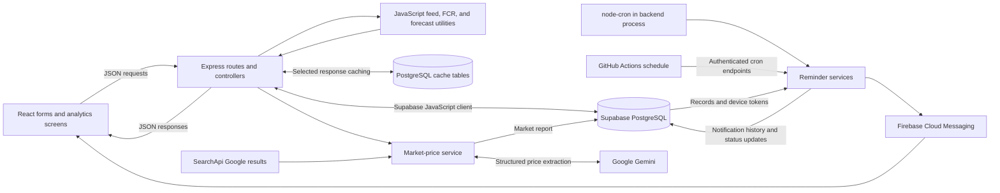
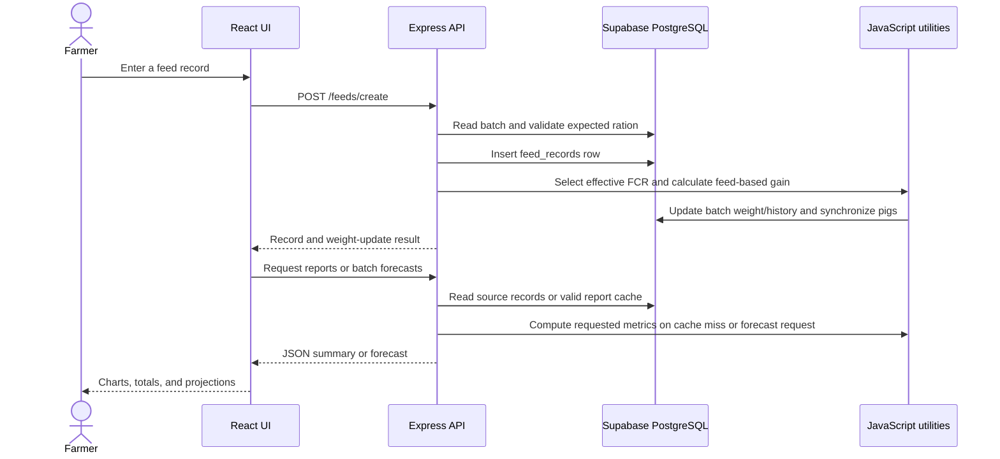

# PrepAPig: AI-Powered Pig Growth Tracker with Vaccination Scheduling and Feed Consumption System #

## Team Members 
| Name     | Role               |
| -------- | ------------------ |
| Patal, Mark Angelo G. | Backend Developer |
| Isabella Grace M. Elola | Frontend Developer  |
| Maris N. De Lunas | Frontend Developer |

## Overview 

PrepAPig is a web-based livestock management system designed to assist pig farmers and caretakers in monitoring pig growth, tracking feed consumption, and managing vaccination schedules. The system utilizes Artificial Intelligence (AI) to analyze growth trends and provide predictive insights that support decision-making in pig farming operations.

The project aims to improve farm productivity by digitizing traditional record-keeping processes, reducing manual errors, and providing real-time access to important livestock information.

## Features 

Pig profile management
Growth tracking and monitoring
Feed consumption recording
Vaccination scheduling and reminders
AI-powered growth prediction
Analytics and reporting dashboard
User authentication and role-based access control
Historical record management

## Project Motivation 

Traditional pig farming often relies on manual record-keeping methods that can be time-consuming, prone to errors, and difficult to manage. PrepAPig was developed to provide an efficient digital solution that centralizes livestock records, automates monitoring tasks, and assists caretakers in making data-driven decisions.

## Problem Statement ##

### Pig farmers and caretakers frequently face challenges such as: 

Inaccurate or incomplete growth records
Difficulty monitoring feed consumption
Missed vaccination schedules
Lack of predictive tools for growth assessment
Time-consuming manual documentation

PrepAPig addresses these challenges by integrating growth tracking, feed monitoring, vaccination scheduling, and AI-based prediction into a single platform.

## Installation 
### Prerequisites 

### Before installing the system, ensure the following software is installed:

Node.js (v18 or later)
npm (Node Package Manager)
MongoDB or MySQL (depending on project configuration)
Git
Step 1: Clone the Repository
git clone https://github.com/your-username/prepapig.git
cd prepapig
Step 2: Install Dependencies
npm install
Step 3: Configure Environment Variables

Create a .env file in the root directory and add the required configuration:

PORT=3000
DB_URI=your_database_connection_string
JWT_SECRET=your_secret_key
Step 4: Start the Database

Ensure your database server is running before launching the application.

Step 5: Run the Application

Development Mode:

npm run dev

Production Mode:

npm start
Step 6: Access the Application

Open your browser and navigate to:

http://localhost:3000
github.com

## Usage

### Login

Launch the application.
Enter your username and password.
Access the dashboard after successful authentication.

### Managing Pig Records
Navigate to the Pig Management module.
Add, edit, or remove pig profiles.
Update weight and health information as needed.

### Recording Feed Consumption
Open the Feed Monitoring module.
Select a pig profile.
Enter feed consumption details.
Save the record.

### Scheduling Vaccinations

Open the Vaccination Management module.
Select a pig profile.
Set vaccination dates and vaccine information.
Receive reminders for upcoming schedules.

### Viewing AI Predictions
Access the Analytics Dashboard.
Select a pig profile.
Review AI-generated growth forecasts and recommendations.

### System Architecture

Frontend:
    HTML
    CSS
    JavaScript

Backend:
    Node.js
    Express.js

Database:
    MongoDB/MySQL

AI Module:
    Machine Learning-based Growth Prediction

## Database Schema

### users
| Field         | Data Type    | Constraints               | Description            |
| ------------- | ------------ | ------------------------- | ---------------------- |
| user_id       | INT          | PK, AUTO_INCREMENT        | Unique user identifier |
| full_name     | VARCHAR(100) | NOT NULL                  | Owner's full name      |
| email         | VARCHAR(100) | UNIQUE, NOT NULL          | User email address     |
| password_hash | VARCHAR(255) | NOT NULL                  | Encrypted password     |
| created_at    | TIMESTAMP    | DEFAULT CURRENT_TIMESTAMP | Account creation date  |

### pig_batches
| Field          | Data Type                         | Constraints               | Description             |
| -------------- | --------------------------------- | ------------------------- | ----------------------- |
| batch_id       | INT                               | PK, AUTO_INCREMENT        | Unique batch identifier |
| batch_code     | VARCHAR(50)                       | UNIQUE, NOT NULL          | Batch reference code    |
| pig_count      | INT                               | NOT NULL                  | Number of pigs in batch |
| arrival_date   | DATE                              | NOT NULL                  | Date pigs arrived       |
| initial_weight | DECIMAL(8,2)                      | NOT NULL                  | Initial average weight  |
| feed_type      | VARCHAR(100)                      | NOT NULL                  | Assigned feed type      |
| status         | ENUM('Active','Sold','Completed') | NOT NULL                  | Current batch status    |
| created_at     | TIMESTAMP                         | DEFAULT CURRENT_TIMESTAMP | Record creation date    |

### growth_records
| Field          | Data Type    | Constraints        | Description            |
| -------------- | ------------ | ------------------ | ---------------------- |
| growth_id      | INT          | PK, AUTO_INCREMENT | Unique growth record   |
| batch_id       | INT          | FK                 | References pig_batches |
| average_weight | DECIMAL(8,2) | NOT NULL           | Average batch weight   |
| record_date    | DATE         | NOT NULL           | Recording date         |
| remarks        | TEXT         | NULL               | Additional notes       |
| Column   | References            |
| -------- | --------------------- |
| batch_id | pig_batches(batch_id) |

### vaccination_records
| Field          | Data Type                             | Constraints        | Description               |
| -------------- | ------------------------------------- | ------------------ | ------------------------- |
| vaccination_id | INT                                   | PK, AUTO_INCREMENT | Unique vaccination record |
| batch_id       | INT                                   | FK                 | References pig_batches    |
| vaccine_name   | VARCHAR(100)                          | NOT NULL           | Vaccine administered      |
| scheduled_date | DATE                                  | NOT NULL           | Planned vaccination date  |
| completed_date | DATE                                  | NULL               | Actual vaccination date   |
| status         | ENUM('Pending','Completed','Overdue') | NOT NULL           | Vaccination status        |
| Column   | References            |
| -------- | --------------------- |
| batch_id | pig_batches(batch_id) |

### expenses
| Field        | Data Type                                           | Constraints        | Description            |
| ------------ | --------------------------------------------------- | ------------------ | ---------------------- |
| expense_id   | INT                                                 | PK, AUTO_INCREMENT | Unique expense record  |
| batch_id     | INT                                                 | FK                 | References pig_batches |
| category     | ENUM('Feed','Vaccine','Piglet','Utilities','Other') | NOT NULL           | Expense category       |
| amount       | DECIMAL(10,2)                                       | NOT NULL           | Expense value          |
| description  | TEXT                                                | NULL               | Expense details        |
| expense_date | DATE                                                | NOT NULL           | Date expense occurred  |
| Column   | References            |
| -------- | --------------------- |
| batch_id | pig_batches(batch_id) |

### notifications
| Field             | Data Type                     | Constraints               | Description                |
| ----------------- | ----------------------------- | ------------------------- | -------------------------- |
| notification_id   | INT                           | PK, AUTO_INCREMENT        | Unique notification        |
| batch_id          | INT                           | FK                        | References pig_batches     |
| notification_type | VARCHAR(100)                  | NOT NULL                  | Reminder or alert type     |
| message           | TEXT                          | NOT NULL                  | Notification content       |
| status            | ENUM('Pending','Sent','Read') | NOT NULL                  | Notification state         |
| created_at        | TIMESTAMP                     | DEFAULT CURRENT_TIMESTAMP | Notification creation date |
| Column   | References            |
| -------- | --------------------- |
| batch_id | pig_batches(batch_id) |

### reports
| Field          | Data Type    | Constraints        | Description              |
| -------------- | ------------ | ------------------ | ------------------------ |
| report_id      | INT          | PK, AUTO_INCREMENT | Unique report identifier |
| report_type    | VARCHAR(100) | NOT NULL           | Report category          |
| generated_date | DATETIME     | NOT NULL           | Date generated           |
| file_path      | VARCHAR(255) | NOT NULL           | Report storage location  |

## Database Entity Relationship ##
| Parent Table | Relationship | Child Table                                   |
| ------------ | ------------ | --------------------------------------------- |
| pig_batches  | 1 : Many     | growth_records                                |
| pig_batches  | 1 : Many     | feed_records                                  |
| pig_batches  | 1 : Many     | vaccination_records                           |
| pig_batches  | 1 : Many     | expenses                                      |
| pig_batches  | 1 : Many     | notifications                                 |
| users        | 1 : Many     | pig_batches (optional ownership relationship) |

## Development Roadmap
### Sprint 1
Project setup
Authentication
Database creation
### Sprint 2
Pig batch management
Growth monitoring
### Sprint 3
Feed and vaccination modules
### Sprint 4
Expense tracking
Reports
### Sprint 5
Analytics
Notifications
### Sprint 6
Offline support
Deployment

## API Endpoints (Planned)
| Method | Endpoint          | Description                  |
| ------ | ----------------- | ---------------------------- |
| POST   | /auth/login   | User login                   |
| POST   | /auth/register | User registration | 
| GET    | /api/batches      | Retrieve batches             |
| POST   | /api/batches      | Create batch                 |
| GET    | /api/feed         | Retrieve feed records        |
| POST   | /api/feed         | Create feed record           |
| GET    | /api/vaccinations | Retrieve vaccination records |
| POST   | /api/vaccinations | Create vaccination record    |
| GET    | /api/expenses     | Retrieve expenses            |
| POST   | /api/expenses     | Create expense record        |

## Frontend Dependencies

| Package             | Purpose                                      |
|---------------------|----------------------------------------------|
| react               | Frontend UI Library                          |
| react-dom           | React DOM Rendering                          |
| react-router-dom    | Client-Side Routing                          |
| axios               | HTTP Requests to Backend APIs                |
| jwt-decode          | Decode JWT Authentication Tokens             |
| chart.js            | Data Visualization and Analytics Charts      |
| react-chartjs-2     | React Wrapper for Chart.js                   |
| react-icons         | User Interface Icons                         |
| sweetalert2         | Interactive Alert and Confirmation Dialogs   |
| react-toastify      | Toast Notification Messages                  |
| date-fns            | Date Formatting and Manipulation             |
| firebase            | Firebase Cloud Messaging Integration         |
| idb                 | IndexedDB Management for Offline Storage     |
| workbox-window      | Service Worker Communication                 |
| vite-plugin-pwa     | Progressive Web Application Support          |
| tailwindcss         | Utility-First CSS Framework                  |
| @tailwindcss/vite   | Tailwind CSS Integration for Vite            |

## Backend Dependencies

| Package           | Purpose                         |
| ----------------- | ------------------------------- |
| express           | REST API Framework              |
| mysql2            | MySQL Database Driver           |
| cors              | Allow Frontend Requests         |
| dotenv            | Environment Variables           |
| jsonwebtoken      | JWT Authentication              |
| bcryptjs          | Password Hashing                |
| cookie-parser     | Cookie Handling                 |
| express-validator | Request Validation              |
| firebase-admin    | Firebase Notifications          |
| node-cron         | Scheduled Reminder Tasks        |
| morgan            | Request Logging                 |
| nodemon           | Auto Restart During Development |

## Frontend Dependencies Installations

npm install express
npm install mysql2
npm install cors
npm install dotenv
npm install jsonwebtoken
npm install bcryptjs
npm install cookie-parser
npm install express-validator
npm install multer
npm install firebase-admin
npm install node-cron

frontend/
│
├── public/                         # Static files
│
├── src/
│   │
│   ├── assets/                     # Images, icons, fonts
│   ├── components/                 # Reusable UI components
│   ├── pages/                      # Page components
│   ├── hooks/                      # Custom React hooks
│   ├── contexts/                   # Context providers
│   ├── services/                   # API communication
│   ├── utils/                      # Helper functions
│   ├── routes/                     # Route configuration
│   │
│   ├── App.jsx                     # Root component
│   └── main.jsx                    # Entry point
│
├── .env                            # Environment variables
├── .gitignore                      # Git ignore rules
├── package.json                    # Dependencies
└── README.md                       # Frontend documentation

backend/
│
├── src/
│   │
│   ├── config/                     # Database & Firebase configuration
│   ├── controllers/                # Route controllers
│   ├── models/                     # Database models
│   ├── routes/                     # API routes
│   ├── middleware/                 # Authentication & validation
│   ├── services/                   # Business logic
│   ├── utils/                      # Helper functions
│   ├── jobs/                       # Scheduled reminder tasks
│   │
│   └── app.js                      # Express application setup
│
├── .env                            # Environment variables
├── .gitignore                      # Git ignore rules
├── package.json                    # Dependencies
├── README.md                       # Backend documentation
└── server.js                       # Entry point

## Data Pipeline Technical Metadata Documentation

### 1. Pipeline Overview

**Pipeline Name:** PrepAPig Farm Records and Analytics Pipeline

**Purpose:** Capture farm records, maintain batch and individual-pig data, calculate feed and growth indicators, provide cost and profitability projections, and deliver feeding and vaccination reminders.

**Implementation:** React forms send JSON requests to a Node.js/Express API. Controllers store operational records in Supabase PostgreSQL and invoke JavaScript services for weight updates, feed schedules, summaries, and forecasts. Analytics are calculated when requested, with selected responses cached in PostgreSQL. Scheduled jobs process reminders separately.

**Scope:** This metadata describes the repository implementation reviewed on September 28, 2026. Schema definitions are based on the checked-in SQL migrations; they do not establish the state of a deployed database. The application contains no Python ingestion service, Apache Airflow DAG, dedicated analytics warehouse, or growth-model training pipeline.

### 2. Pipeline Architecture

```mermaid
flowchart LR
    UI[React forms and analytics screens] -->|JSON requests| API[Express routes and controllers]
    API <-->|Supabase JavaScript client| DB[(Supabase PostgreSQL)]
    API --> CALC[JavaScript feed, FCR, and forecast utilities]
    CALC --> API
    API <-->|Selected response caching| CACHE[(PostgreSQL cache tables)]
    API -->|JSON responses| UI

    CRON[node-cron in backend process] --> REM[Reminder services]
    GH[GitHub Actions schedule] -->|Authenticated cron endpoints| REM
    DB -->|Records and device tokens| REM
    REM -->|Notification history and status updates| DB
    REM --> FCM[Firebase Cloud Messaging]
    FCM --> UI

    API --> MARKET[Market-price service]
    SEARCH[SearchApi Google results] --> MARKET
    MARKET <-->|Structured price extraction| AI[Google Gemini]
    MARKET -->|Market report| DB
```

**Processing paths:**

- **Record ingestion:** `backend/app.js` mounts routes for batches, feeds, vaccinations, expenses, and other modules. Controllers write through `backend/config/supabase.js`.
- **Analytics:** `backend/controllers/reportController.js` computes counts and totals. `backend/lib/fcrService.js`, `feedProgram.js`, `feedScheduleService.js`, and `forecastUtils.js` calculate domain-specific results.
- **Presentation:** `frontend/src/pages/AnalyticsReportScreen.jsx` loads operational records and batch-specific API results, performs additional client-side aggregation, and renders Recharts visualizations.
- **Market enrichment:** `backend/services/marketPriceService.js` sends SearchApi results to Gemini, validates the returned JSON, and attempts to save a report with source references and a six-hour expiry. Its database-schema dependency is described in Section 7.
- **Notifications:** `backend/scheduler.js` and `.github/workflows/cron-reminders.yml` invoke reminder processing; Firebase delivers push messages to registered devices.

### 3. Pipeline Metadata

| Metadata | Implemented value |
|----------|-------------------|
| Sources | User-entered batch, pig, feed, vaccination, stock, expense, and weight records; static 26-week feed program; external market-search results |
| Ingestion interface | HTTP requests handled by Express 5; primary application payload format is JSON |
| Frontend | React 19, Vite 8, Tailwind CSS 4, React Router 7, and Recharts 3; versions refer to package manifest ranges |
| Backend | Node.js with JavaScript ES modules, Express, and `@supabase/supabase-js` |
| Transformation layer | JavaScript controllers and utilities: numeric conversion, grouping, totals, FCR, feed-program lookup, moving averages, and forecast calculations |
| Storage | Supabase PostgreSQL operational tables; JSONB weight history and cache payloads |
| Processing frequency | Record changes are request-driven; reports and forecasts are computed on demand |
| Authentication | Normal registration/login uses Supabase Auth; the backend issues a custom one-day JWT, verified by `authMiddleware` on protected routes |
| Reference data | `backend/lib/feedProgram.js` defines weeks, phases, rations, feed quantities, and reference prices |
| Units | Feed and weight quantities in kilograms; feed bags treated as 50 kg; cost projections in Philippine pesos (PHP) |
| Outputs | Operational API responses, report summaries, FCR/weight history, feed targets, forecasts, market reports, notification history, and push messages |
| Runtime dependencies | Supabase access; Firebase configuration for push delivery; SearchApi and Gemini credentials for market refreshes; a running backend process for in-process cron jobs |

**Schedules and freshness:**

| Process | Trigger or lifetime | Source |
|---------|---------------------|--------|
| Feed, vaccination, and feed-change reminders | Daily at 06:00 using `0 6 * * *` | `backend/scheduler.js` |
| Additional feed-reminder checks | Hourly using `0 * * * *` | `backend/scheduler.js` |
| External feed and vaccination reminder triggers | GitHub Actions schedule every 30 minutes (`*/30 * * * *`), plus manual dispatch | `.github/workflows/cron-reminders.yml` |
| Dashboard and batch-list cache | Five-minute default TTL | `backend/lib/supabaseCache.js` |
| Feed and expense summary cache | Ten-minute default TTL | `backend/lib/supabaseCache.js` |
| Generic API cache | Five-minute default TTL | `backend/lib/supabaseCache.js` |
| Market-price report | Six-hour expiry; refreshed on lookup when absent/expired, or through the refresh endpoint | `backend/services/marketPriceCacheService.js` |

The in-process scheduler does not set a timezone, so it uses the backend runtime's timezone. GitHub Actions schedules use UTC. Reminder services build their `today` date using UTC ISO strings. Controllers explicitly invalidate selected caches after mutations; expired cache entries are rejected on lookup. There is no nightly analytics-load job.

**Configuration metadata:**

| Location | Variables | Purpose |
|----------|-----------|---------|
| Backend environment | `PORT` (default `5000`), `SUPABASE_URL`, `SUPABASE_ANON_KEY`, `JWT_SECRET` | API listener, database client, and custom JWT signing/verification |
| Backend environment | `FIREBASE_PROJECT_ID`, `FIREBASE_CLIENT_EMAIL`, `FIREBASE_PRIVATE_KEY` | Firebase Admin initialization |
| Backend environment | `GEMINI_API_KEY`, `SEARCHAPI_API_KEY` | Market-search and generative-AI integration |
| Backend environment | `FORECAST_TARGET_WEIGHT_KG` (default `95`) | Target used by forecast endpoints |
| Backend environment | `CRON_SECRET` | Bearer-token authentication for external cron triggers |
| Frontend environment | `VITE_API_BASE` (default `http://localhost:5000`) | Backend URL used by `frontend/src/api.js` |
| GitHub Actions secrets | `API_BASE_URL`, `CRON_SECRET` | Deployed backend URL and credentials for reminder jobs |

### 4. Data Lineage

**Primary record-to-report flow:**

```mermaid
sequenceDiagram
    actor Farmer
    participant UI as React UI
    participant API as Express API
    participant DB as Supabase PostgreSQL
    participant Calc as JavaScript utilities
    Farmer->>UI: Enter a feed record
    UI->>API: POST /feeds/create
    API->>DB: Read batch and validate expected ration
    API->>DB: Insert feed_records row
    API->>Calc: Select effective FCR and calculate feed-based gain
    Calc->>DB: Update batch weight/history and synchronize pigs
    API-->>UI: Record and weight-update result
    UI->>API: Request reports or batch forecasts
    API->>DB: Read source records or valid report cache
    API->>Calc: Compute requested metrics on cache miss or forecast request
    API-->>UI: JSON summary or forecast
    UI-->>Farmer: Charts, totals, and projections
```

| Stage | Input | Implemented processing | Output / destination |
|-------|-------|------------------------|----------------------|
| Batch creation | Batch code, count, weights, acquisition date, breed, status | Attach `req.user.id` as owner, insert batch, and attempt to generate individual pigs at `current_weight / pig_count` | `pig_batches`, `pigs` |
| Feed ingestion | Batch, feed type, kilograms, feeding date/time | Check expected ration when the batch is found; reject mismatches unless `override` is supplied; insert record | `feed_records` |
| Feed-derived growth | Feed quantity and effective FCR | Add `feedKg / FCR` to batch weight, append an `auto_feed` history entry, and attempt to synchronize individual pig weights | `pig_batches.current_weight`, `weight_history`, `pigs.weight` |
| Manual weight logging | Batch ID, weight, notes | Update batch weight, append a `manual` history entry, and attempt pig synchronization | `pig_batches`, `pigs` |
| Vaccination ingestion | Vaccine, dosage, dates, status | Insert record; for positive dosage, attempt stock deduction with a zero lower bound; create notification history and push messages when applicable | `vaccination_records`, `vaccine_stocks`, `notifications`, FCM |
| Report aggregation | Batch, feed, vaccination, and expense records | Count records and sum feed quantities or expense amounts in JavaScript | `/reports/*` JSON responses and selected cache entries |
| Batch forecasting | Weight history, feed history, stock prices, expenses | Calculate days to market, consumption projections, feed costs, and profitability scenarios | `/api/forecast/batch/:id/*` JSON responses |
| Feed-program analysis | Acquisition date, pig count, static program, prices, actual feed records | Determine week/phase, feed targets, planned cost, and actual-versus-planned consumption | `/feed-program/batch/:batchId/*` JSON responses |
| Market enrichment | SearchApi results for live-hog prices | Gemini extraction, JSON parsing, required-field/type checks, and source URL collection | Intended `market_price_reports` insert; see schema mismatch in Section 7 |
| Reminder processing | Feeding dates, vaccination due dates/status, feed transitions, device tokens | Select reminder candidates, mark overdue vaccinations, write notifications, send FCM messages, and update feed reminder flags | Operational status changes and push messages |

**Calculation metadata:**

- **FCR:** `sum(feed_records.quantity_kg) / (last history weight - first history weight)`. Calculation requires feed records and at least two history entries with positive weight gain. Confidence is based on feed-record count: low below 5, medium at 5–9, high at 10 or more. Effective FCR selection respects stored manual/calculated values and otherwise uses phase defaults; a batch marked `default` keeps its phase-based FCR until explicitly recalculated or changed.
- **Weight provenance:** History entries contain `date`, `weight`, `source`, and `notes`. Manual and feed-derived entries use the logging day's UTC date; automatic entries do not use the submitted `feeding_date`.
- **Daily gain:** `(last weight - first weight) / elapsed days` from chronologically sorted history. The days-to-market endpoint also attempts a separate linear-regression/R-squared calculation; the gain rate itself comes from the first and last observations.
- **Days to market:** `ceil((targetWeight - currentWeight) / dailyGainRate)`. The helper returns zero days and a null date if gain is missing/nonpositive or the target is already reached.
- **Feed needs:** Group records by feeding date, average the recorded-day totals, apply a moving-average trend adjustment when enough observations exist, and distribute the projection by historical feed-type proportions. Dates without records are not filled with zeros. The `days` query defaults to 30 and is bounded to 1–365.
- **Feed cost:** Multiply projected kilograms by matching `feed_stocks.unit_price`; unmatched prices contribute zero in `forecastUtils.js`. This history-based forecast is separate from the static feed-program cost forecast.
- **Profitability:** The endpoint uses a 90-day feed-cost projection and a fixed PHP 190/kg market price, with conservative/expected/optimistic revenue multipliers of 0.9/1.0/1.1. It subtracts projected feed cost and current plus estimated remaining expenses. It does not read the Gemini market report.

### 5. Schema Metadata

**Source definitions:**

1. [`backend/supabase/main_tables_migration.sql`](backend/supabase/main_tables_migration.sql) defines operational tables, indexes, triggers, and row-level security policies.
2. [`backend/supabase/fcr_migration.sql`](backend/supabase/fcr_migration.sql) extends `pig_batches` with JSONB weight history and FCR fields; it depends on the batch table already existing.
3. [`backend/supabase/cache_tables.sql`](backend/supabase/cache_tables.sql) defines response-cache tables and a `clean_expired_cache()` function.

**Operational tables:** All ten application tables below use `id UUID PRIMARY KEY DEFAULT gen_random_uuid()`. The columns listed are the principal pipeline fields, not a complete DDL listing.

| Table | Grain | Principal columns and types |
|-------|-------|-----------------------------|
| `pig_batches` | One batch | `batch_code VARCHAR(50) UNIQUE NOT NULL`, `pig_count INTEGER`, `breed VARCHAR(100)`, `start_weight DECIMAL(8,2)`, `current_weight DECIMAL(8,2)`, `date_acquired DATE`, `status VARCHAR(20)`, `owner_id UUID` |
| `pigs` | One pig within a batch | `batch_id UUID NOT NULL`, `weight DECIMAL(8,2)`, `health_status VARCHAR(20)`, `notes TEXT` |
| `feed_records` | One feed entry for a batch | `batch_id UUID NOT NULL`, `feed_type VARCHAR(100)`, `quantity_kg DECIMAL(8,2)`, `feeding_date DATE`, `feeding_time TIME`, `reminder_sent BOOLEAN DEFAULT FALSE` |
| `feed_stocks` | One stock row per feed type | `feed_type VARCHAR(100) UNIQUE NOT NULL`, `stock_quantity DECIMAL(8,2)`, `unit_price DECIMAL(10,2)`, `last_updated TIMESTAMPTZ` |
| `vaccination_records` | One vaccination entry for a batch | `batch_id UUID NOT NULL`, `vaccine_name VARCHAR(100)`, `vaccination_date DATE`, `next_due_date DATE`, `administered_by VARCHAR(100)`, `dosage INTEGER`, `status VARCHAR(20)` |
| `vaccine_stocks` | One stock row per vaccine name | `vaccine_name VARCHAR(100) UNIQUE NOT NULL`, `stock_quantity INTEGER`, `price_per_dose DECIMAL(10,2)`, `expiry_date DATE` |
| `expenses` | One expense entry | Nullable `batch_id UUID`, `expense_type VARCHAR(50)`, `amount DECIMAL(10,2)`, `expense_date DATE`, `description TEXT` |
| `notifications` | One user notification | `user_id UUID NOT NULL`, `title VARCHAR(200)`, `message TEXT`, `type VARCHAR(50)`, `is_read BOOLEAN DEFAULT FALSE`, legacy `recipient_token VARCHAR(500)` |
| `user_devices` | One registered FCM token | `user_id UUID NOT NULL`, `fcm_token VARCHAR(500) UNIQUE NOT NULL`, `device_type VARCHAR(20)`, `app_version VARCHAR(20)` |
| `market_price_reports` | One stored price report in the migration | `report_date DATE`, `price_per_kg DECIMAL(10,2) NOT NULL`, `source VARCHAR(100)`, `region VARCHAR(100)`, `notes TEXT`; differs from service expectations |

**Weight-history and FCR fields on `pig_batches`:**

| Column | SQL type / default | Meaning |
|--------|--------------------|---------|
| `weight_history` | `JSONB DEFAULT '[]'::jsonb` | Array of dated weight entries with source and notes; indexed with GIN |
| `current_fcr` | `DECIMAL(5,2)` | Stored feed conversion ratio |
| `fcr_source` | `VARCHAR(20) DEFAULT 'default'` | Application values: `default`, `calculated`, `manual` |
| `fcr_confidence` | `VARCHAR(20)` | Stored confidence label for calculated FCR |
| `fcr_data_points` | `INTEGER DEFAULT 0` | Feed-record count used for calculation |

**Relationships and constraints:**

| Parent | Child / foreign key | Delete behavior |
|--------|---------------------|-----------------|
| `auth.users.id` | `pig_batches.owner_id` | Default PostgreSQL foreign-key behavior; no cascading delete specified |
| `pig_batches.id` | `pigs.batch_id`, `feed_records.batch_id`, `vaccination_records.batch_id` | `ON DELETE CASCADE` |
| `pig_batches.id` | `expenses.batch_id` | `ON DELETE SET NULL` |
| `auth.users.id` | `notifications.user_id`, `user_devices.user_id` | `ON DELETE CASCADE` |

Stock matching uses feed/vaccine names in application code, without foreign keys from records to stock tables. Status fields are `VARCHAR`, with expected values documented in comments rather than enforced SQL enums. The migrations do not define `growth_records`, `growth_analytics`, `vaccination_compliance`, or `feed_efficiency` tables; weight history is embedded in batches and analytical results are produced by application code.

**Cache schema:** `api_cache`, `dashboard_cache`, `feed_summary_cache`, `expense_summary_cache`, and `batch_list_cache` share `key TEXT PRIMARY KEY`, `data JSONB NOT NULL`, `expires_at TIMESTAMPTZ NOT NULL`, and creation/update timestamps. They hold replaceable response data. Forecast controller results are returned directly without persistence in a forecast table.

### 6. Technology Justification

| Technology | Suitability for this implementation | Actual role |
|------------|-------------------------------------|-------------|
| React, Vite, Tailwind CSS, Recharts | Supports interactive forms, responsive screens, and chart rendering in the browser | Data entry and analytics presentation |
| Node.js / Express | Uses the same JavaScript language as the frontend and supports modular HTTP handlers | Request ingestion, controller logic, and JSON responses |
| Supabase / PostgreSQL | Provides relational storage, foreign keys, indexes, Auth, and JSONB fields through a JavaScript client | Operational persistence, weight history, and response caches |
| JavaScript utilities / `simple-statistics` | Supports arithmetic, moving averages, and regression without a separate analytics service | FCR, feed-program calculations, and statistical forecast code |
| `node-cron` / GitHub Actions | Supports in-process timed tasks and externally triggered HTTP jobs | Reminder scheduling |
| Firebase Admin SDK / FCM | Supports push delivery to registered browser/device tokens | Feeding, vaccination, and feed-transition notifications |
| SearchApi / Google GenAI SDK | Supplies search evidence and structured extraction of live-hog market information | Market-price enrichment; separate from growth forecasting |

### 7. Implementation Boundaries and Data-Quality Notes

- **Weight units need reconciliation:** Batch creation and FCR synchronization treat `current_weight` as total batch weight and divide it by `pig_count` for individual pigs. Forecasting compares this stored value directly with the default 95 kg target, while revenue uses `targetWeight * pigCount`. Forecast outputs therefore currently mix batch-total and per-pig assumptions.
- **Market schema differs from the service contract:** The service reads/writes fields such as `location`, `price_min`, `price_max`, `price_unit`, `reported_date`, `reported_location`, `summary`, `confidence`, `sources`, `checked_at`, `expires_at`, and `status`. These are absent from the checked-in `market_price_reports` definition, which instead requires `price_per_kg`. The migrations alone do not provision the service's expected schema.
- **Timestamp triggers also need schema alignment:** The main migration attaches an `updated_at` trigger to `feed_stocks`, `notifications`, and `market_price_reports`, but those table definitions do not include an `updated_at` column.
- **Validation is endpoint-specific:** The code checks feed-ration compatibility, feed-program week ranges, and selected forecast inputs. It does not implement the previously described general deduplication, staging, or comprehensive data-cleaning layer. Feed insertion, weight updates, pig synchronization, and notifications are separate calls rather than one atomic transaction.
- **Access metadata has limits:** The migration defines ownership policies for batches and related records, public reads for stock/market data, and broader policies for unassigned expenses. Cache tables have grants but no RLS definitions in their migration. The custom API JWT middleware sets `req.user`; it does not establish a request-scoped Supabase session. These definitions should not be described as verified end-to-end per-user isolation.
- **Forecasts are application calculations:** Growth and feed projections use recorded values, formulas, and statistical helpers. Gemini is invoked for market-price extraction. There is no implemented growth-model training, model registry, or persisted analytics-table refresh workflow.

**Source map for maintenance:** API mounts in [`backend/app.js`](backend/app.js); calculations in [`backend/lib/`](backend/lib/); ingestion and report handlers in [`backend/controllers/`](backend/controllers/); reminders and market integrations in [`backend/services/`](backend/services/); database definitions in [`backend/supabase/`](backend/supabase/); analytics presentation in [`frontend/src/pages/AnalyticsReportScreen.jsx`](frontend/src/pages/AnalyticsReportScreen.jsx).
